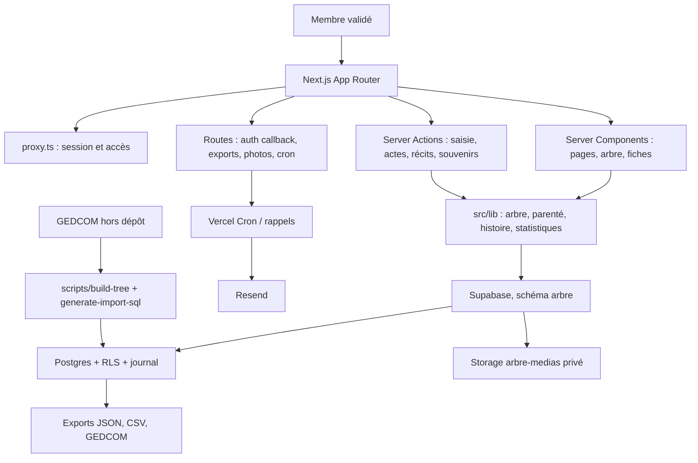

# Audit généalogie master — L’arbre de Léo

**Date :** 7 août 2026
**Périmètre :** dépôt `arbre-leo`, branche `main` (`84c3313`), schéma Supabase `arbre` consulté en lecture seule.
**Méthode :** lecture du code, des 29 migrations, de la configuration Next/Vercel, des tests et des contrôles Supabase. Aucune donnée familiale, règle RLS, migration ou composant n’a été modifié pendant cet audit.

## 1. Résumé exécutif

Le projet est déjà bien davantage qu’un visualiseur GEDCOM : c’est une application privée de transmission familiale, avec graphe, preuves, chronologie, carte, récits, souvenirs, dépôt d’actes, recherches ouvertes, administration et export. Son choix fondamental — données en base privée, code public, validation humaine des membres — est le bon.

La priorité n’est **pas** une refonte ni une couche IA. Pour devenir une archive fiable sur cinquante ans, il faut d’abord rendre la chaîne de confiance mesurable : import traçable, sauvegarde et restauration testées, contrôles d’intégrité exécutés régulièrement, et environnement de test reproductible. Les cartes historiques, le voyage temporel et l’OCR viennent ensuite, une fois ces fondations établies.

### Verdict

| Axe | État | Point déterminant |
| --- | --- | --- |
| Architecture applicative | Bon | App Router, découpage métier clair, sans ORM superflu. |
| Confidentialité | Bon avec réserve | RLS, bucket privé et URL signées sont bien employés ; un avertissement RLS subsiste sur `arbre.rappels_envoyes`. |
| Modèle généalogique | Bon | Personnes, unions, filiations, événements, lieux et preuves sont séparés. |
| Provenance archivistique | Moyen | Les sources sont reliées, mais la granularité « assertion ↔ source » et les métadonnées de document sont insuffisantes à long terme. |
| Tests et reproductibilité | Moyen-faible | La suite TypeScript locale échoue car `@playwright/test` n’est pas installé dans `node_modules`, alors qu’il est déclaré dans `package.json`. |
| Passage à l’échelle | Bon jusqu’à quelques milliers de personnes | Le SVG/D3 et le chargement du graphe complet devront évoluer pour 10 000+ personnes. |

## 2. Architecture actuelle

### Stack détectée

- Next.js **16.3.0**, App Router et Turbopack ; React **19.2.8** ; TypeScript strict.
- npm et lockfile npm ; Node non épinglé dans le dépôt.
- Supabase : Postgres 17, Auth, Storage privé et schéma `arbre` ; pas d’ORM.
- UI : Tailwind CSS 4 ; visualisation d’arbre SVG avec `d3-zoom` et géométrie maison.
- Déploiement : Vercel, production uniquement sur `main` ; Cron quotidien à 06:00 UTC.
- Services optionnels : Resend pour les rappels, clé IA serveur (`ARBRE_IA_CLE`) avec repli déterministe.

### Carte du système

### Flux et responsabilités

- `src/proxy.ts` encadre les routes privées par session Supabase ; les politiques RLS restent l’autorité de sécurité.
- `src/lib/arbre.ts` charge et assemble personnes, unions, filiations et événements ; il crée des URL de photos signées seulement quand nécessaire.
- `src/lib/layout-arbre.ts` et `src/lib/geometrie-liens.ts` portent le cœur du rendu généalogique ; `src/components/arbre/*` le rend en SVG avec D3.
- `src/app/actions/*` concentre les écritures métier. La validation Zod et les contrôles de rôle doivent rester la règle à chaque nouvelle action.
- `supabase/migrations/0001` à `0029` versionnent le socle, RLS, stockage, anti-doublons, intégrité et fonctionnalités collaboratives.
- Les scripts GEDCOM sont volontairement hors du chemin d’exécution web et produisent un import SQL idempotent.

## 3. Forces observées

1. **Séparation code/données forte.** `README.md`, `.gitignore` et `scripts/verifier-avant-commit.mjs` réduisent réellement le risque de publier des données familiales.
2. **Accès privé par défaut.** `supabase/migrations/0004_rls.sql` active RLS et interdit l’accès aux comptes non validés ; `arbre.medias` est privé et les médias passent par URL signées.
3. **Modèle cohérent.** `personnes`, `unions`, `filiations`, `evenements`, `lieux`, `sources`, `medias`, `souvenirs`, `faits_historiques`, `chantiers_recherche` et `journal` couvrent déjà l’essentiel d’un musée familial.
4. **Niveaux de preuve.** Le type `niveau_preuve` et `src/lib/preuves.ts` empêchent conceptuellement de confondre acte, mémoire et hypothèse.
5. **Import rejouable.** `0007_import_idempotent.sql` utilise des index `NULLS NOT DISTINCT`; les scripts produisent des blocs sans suppression.
6. **Expérience déjà différenciante.** Arbre, chronologie, carte, histoire, récits, archives, recherche et export sont des fonctions concrètes, non de simples intentions.
7. **Sécurité HTTP existante.** `next.config.ts` fournit CSP, anti-iframe, `nosniff`, Referrer-Policy et Permissions-Policy.

## 4. Faiblesses, risques et constats vérifiés

| Priorité | Constat réel | Conséquence | Recommandation ciblée |
| --- | --- | --- | --- |
| P0 | `npm run typecheck` échoue localement : les fichiers `e2e/*.spec.ts` importent `@playwright/test`, déclaré dans `package.json` mais absent de l’installation actuelle. | La vérification avant publication n’est pas reproductible sur cette machine. | En V1, exécuter `npm ci` dans un environnement propre et rendre la CI bloquante sur `npm ci && npm run typecheck && npm run lint && npm run test:e2e`. Ne pas masquer les erreurs TypeScript. |
| P0 | Le conseiller Supabase signale que `arbre.rappels_envoyes` a RLS activée sans politique. | Cela peut être volontaire pour une table uniquement serveur, mais doit être explicitement démontré ; sinon, le comportement production est fragile. | Décider et documenter : table exclusivement service-role (aucune policy, aucun accès client) ou policy minimale. Ajouter un test du cron et une note dans la migration. |
| P1 | Le même projet Supabase contient de nombreuses tables `public` d’une autre application signalées sans policy. | Le risque est hors du schéma `arbre`, mais un projet partagé agrandit le rayon d’incident et rend l’audit ambigu. | Isoler l’archive familiale dans un projet Supabase dédié, ou établir une revue trimestrielle séparant explicitement les périmètres. |
| P1 | `next.config.ts` autorise `script-src 'unsafe-inline' 'unsafe-eval'`. | Défense CSP réduite en cas de XSS. | Mesurer d’abord les besoins Next en production, puis retirer `unsafe-eval`; remplacer l’inline du thème par nonce/hash lorsque compatible. |
| P1 | `src/lib/arbre.ts` charge le graphe complet et, par défaut, signe tous les portraits. | Pour 2 000+ personnes, latence, mémoire et appels Storage progressent avec l’ensemble de la famille. | Conserver le DTO sans notes, déjà présent, puis généraliser le chargement de sous-graphe et la signature visible/sélectionnée. |
| P1 | Les imports GEDCOM idempotents n’expriment pas une révision d’assertion ni une provenance par champ. | Une correction de date/parenté peut écraser ou coexister sans historique sémantique explicite. | Introduire progressivement une table d’assertions/provenances, sans remplacer le modèle actuel d’un coup. |
| P2 | Les lieux possèdent coordonnées et libellés, mais pas de période de validité, nom historique ou juridiction historique. | Affichage anachronique possible pour communes/frontières anciennes. | Ajouter ultérieurement `noms_lieux` et `juridictions_lieux` datés ; ne pas bloquer les vues actuelles. |
| P2 | Les documents sont traités comme médias, mais checksum, version, transcription, traduction, OCR, institution et cote normalisée ne sont pas un modèle d’archive complet. | Difficile de garantir l’authenticité et la réutilisation dans vingt ans. | Créer une fiche documentaire versionnée, reliée aux médias existants, avant d’automatiser l’OCR. |
| P2 | Le contrôle de cohérence existe (`src/lib/coherence.ts`, `scripts/diagnostic.mjs`), mais il n’est pas encore un contrat de qualité versionné avec seuils. | Les anomalies peuvent être vues mais pas pilotées dans le temps. | Publier une matrice de règles, des niveaux de sévérité et un rapport horodaté d’intégrité à chaque import. |
| P3 | Aucune PWA/offline n’est nécessaire aujourd’hui. | Une PWA prématurée augmente le risque de données privées mises en cache. | Reporter jusqu’à la définition d’un chiffrement/cache local et d’une politique d’effacement. |

## 5. Audit Next.js, React, TypeScript et Vercel

- **Next.js : 83/100.** L’App Router et les Server Components sont bien employés. `proxy.ts` suit la convention Next 16. Les routes d’export et de cron sont séparées. À compléter : un fichier `.nvmrc`/`engines`, et une CI réellement vérifiée depuis un clone vierge.
- **React : 82/100.** Les domaines de composants sont lisibles. Les zones lourdes sont isolées (`ecran-arbre-dynamique`, interactions, impression). Le risque principal reste le coût du DOM/SVG pour un arbre massif, non un défaut de composition.
- **TypeScript : 76/100.** `strict: true` est un bon choix. L’échec actuel de `typecheck` empêche cependant d’accorder une note supérieure avant remise à plat de l’installation de développement.
- **Vercel : 80/100.** `vercel.json` limite les déploiements à `main` et configure le cron. À ajouter : vérification explicite des variables requises par environnement, journal de déploiement et test de santé post-déploiement.

## 6. Audit base, sécurité et confidentialité

### Modèle généalogique

Le modèle supporte correctement : personnes, unions incomplètes, filiations, événements datés partiellement, lieux, sources, médias et niveaux de preuve. Les contraintes `evenements_un_seul_rattachement`, unicité des filiations et index anti-doublons sont pertinentes.

Les manques de long terme sont : variantes de nom, assertions contradictoires simultanées, parenté adoptive/famille recomposée mieux typée, source au niveau d’un attribut précis, et historique des corrections scientifiques.

### Confidentialité et sécurité

La conception est saine : RLS sur le schéma métier, contrôle manuel de l’adhésion, bucket privé, URL signées d’une heure dans `src/lib/arbre.ts`, secret de service réservé aux tâches serveur dans `.env.example`, et CSP globale. Les données d’un vivant doivent rester minimales par défaut ; le champ `confidentiel` devrait être complété par une politique de masquage des relations/événements connexes vérifiée en test.

Le linter Supabase a relevé l’absence de policy sur `arbre.rappels_envoyes` et des alertes dans `public` appartenant à d’autres produits. Aucune conclusion de vulnérabilité ne doit être tirée sans vérifier l’exposition Data API et l’usage service-role, mais ces alertes nécessitent un propriétaire et une décision écrite.

### Sauvegarde et restauration

Le dépôt apporte une bonne traçabilité du schéma, pas encore une stratégie complète de conservation. À instaurer : export Postgres quotidien chiffré, export Storage avec manifest/checksums, export GEDCOM/JSON documenté, rétention 3-2-1, exercice de restauration semestriel et inventaire des détenteurs de secrets. Un backup jamais restauré n’est pas une sauvegarde validée.

## 7. Performance, accessibilité et SEO

- **Performance.** Le gain le plus important est déjà identifié dans `src/lib/arbre.ts` : signer les photos seulement pour les personnes visibles. À 500 personnes, SVG reste réaliste ; à 2 000, charger un sous-graphe et appliquer un niveau de détail ; à 10 000, Canvas/WebGL uniquement pour la vue globale, avec une fiche DOM/SVG accessible à côté.
- **Accessibilité : 78/100.** Le projet prévoit clavier, raccourcis, repères mobiles et thèmes. La validation doit devenir automatisée : axe sur routes clés, navigation clavier complète de l’arbre, focus après ouverture de panneau, zoom 200 %, réduction de mouvement et cibles tactiles 44 px.
- **SEO : 72/100, volontairement.** L’application privée doit rester `noindex`; schema.org Person/publicité n’est pas souhaitable. Optimiser titres, aperçu et partage pour les membres authentifiés, pas l’indexation publique.

## 8. Vision produit et architecture cible

La cible n’est pas « plus de visualisations », mais un **dossier familial vérifiable** :

1. une affirmation (ex. naissance, parenté, résidence) ;
2. un niveau de confiance et une ou plusieurs sources ;
3. un document original/une transcription, sa conservation et son checksum ;
4. une correction datée, attribuée et réversible ;
5. une représentation narrative qui distingue systématiquement fait, contexte et hypothèse.

Le voyage temporel, la carte historique et les récits doivent consommer ce même modèle de preuve. La règle UX à conserver est : *un événement du monde devient un contexte ; il ne devient jamais un fait biographique sans source familiale.*

## 9. Genealogy Integrity Engine proposé

Créer une couche de règles purement déterministes, exécutée à l’import, à la saisie et en CI :

| Règle | Sévérité | Exemple de contrôle |
| --- | --- | --- |
| Cycle d’ascendance | Bloquant | DFS sur filiations : aucun ancêtre ne peut être son descendant. |
| Chronologie vitale | Haute | naissance < décès ; mariage compatible avec décès. |
| Âge parental | Haute | seuils configurables, avertissement et non rejet des cas historiques documentés. |
| Doublon probabiliste | Moyenne | nom normalisé, variantes, dates/lieux et proches communs. |
| Provenance | Moyenne | toute relation/événement important sans preuve est marqué « à confirmer ». |
| Lieu historique | Basse | signaler un libellé contemporain appliqué à une période ancienne. |

Le résultat doit être un rapport versionné : règle, personnes concernées, gravité, preuve, statut de résolution, jamais une « correction » automatique.

## 10. Roadmap priorisée

### V1 — Stabilisation et confiance

1. **P0 : installation/CI reproductible.** Clone neuf, `npm ci`, typecheck, lint, build et E2E en CI ; propriétaire et délai de correction pour les échecs.
2. **P0 : décision RLS de `rappels_envoyes`.** Documenter le modèle service-role ou ajouter la policy minimale ; test de non-accessibilité client.
3. **P1 : plan de sauvegarde/restauration.** Runbook, exports, chiffrement, exercice réel.
4. **P1 : Integrity Engine v0.** Extraire les règles déjà présentes en rapport stable.

### V2 — Expérience fiable

5. **P1 : budget performance arbre.** Mesurer TTFB, JS, nombre de nœuds, signatures et mémoire à 100/500/2 000 personnes.
6. **P1 : tests d’accessibilité et navigation arbre.** Axe + Playwright sur les parcours sensibles.
7. **P2 : panneau de qualité de données.** Compteurs par niveau de preuve et chantiers ouverts, sans stigmatiser les incertitudes.

### V3 — Généalogie et archives

8. **P1 : assertions et provenance par fait.** Pilote sur naissance, décès et filiation.
9. **P2 : modèle documentaire.** Checksum, original/copie, transcription, traduction, institution, cote, droits.
10. **P2 : lieux historiques datés.** Alias, périodes et juridictions.

### V4 à V6 — Histoire, intelligence et transmission

- V4 : frise globale, carte de migrations et contexte historique explicitement non biographique.
- V5 : OCR assisté avec brouillon humain, jamais ingestion automatique ; IA seulement pour résumer des sources déjà validées.
- V6 : export d’archive complet, rôle de conservateur, succession des administrateurs et procédure de transmission familiale.

## 11. Stratégie de tests

| Couche | Cible | Exemple |
| --- | --- | --- |
| Unitaire | géométrie, preuves, dates, règles d’intégrité | cycle, âge parental, date partielle, niveaux de confiance. |
| Intégration | actions + RLS | contributeur ne peut pas publier une donnée protégée ; URL signée refusée hors droit. |
| E2E | parcours membre | connexion, arbre, recherche, fiche, acte, export, mobile, rappel cron. |
| Régression visuelle | arbre à 100/500 nœuds | screenshots de chaque mode et largeur mobile. |
| Restauration | données | import d’un backup dans un projet de récupération, validation checksum. |

## 12. Scores

| Domaine | /100 |
| --- | ---: |
| Architecture | 84 |
| Code et React | 82 |
| TypeScript/reproductibilité | 76 |
| Performance | 78 |
| UX/UI/mobile | 83 |
| Accessibilité | 78 |
| Sécurité/confidentialité | 82 |
| Base de données | 84 |
| Qualité généalogique | 81 |
| Sources et archives | 70 |
| Tests | 70 |
| Documentation | 85 |
| Évolutivité sur 50 ans | 72 |
| **Score global** | **79** |

## 13. Top 20 recommandations

1. Rendre `npm ci` + typecheck réellement verts depuis un clone propre.
2. Décider le statut RLS de `arbre.rappels_envoyes`.
3. Isoler ou gouverner le projet Supabase partagé.
4. Écrire et tester le plan de restauration.
5. Établir un budget de performance de l’arbre.
6. Généraliser le sous-graphe et les photos à la demande.
7. Mettre l’Integrity Engine sous contrat de test.
8. Conserver toute anomalie comme signal, jamais comme correction automatique.
9. Créer les assertions sourcées pour filiation/date/lieu.
10. Ajouter checksum et version aux documents.
11. Distinguer original, copie, transcription, traduction et brouillon OCR.
12. Ajouter les noms historiques et périodes aux lieux.
13. Tester le masquage des personnes confidentielles et de leurs relations.
14. Retirer progressivement `unsafe-eval` de la CSP après mesure.
15. Épingler Node et documenter la mise à niveau des dépendances.
16. Ajouter des tests axe et clavier sur arbre, panneau et formulaires.
17. Ajouter des snapshots de graphe à 100/500/2 000 personnes synthétiques.
18. Garder `noindex` et éviter schema.org Person public.
19. Réserver l’IA à l’assistance réversible et attribuée.
20. Préparer la transmission : second administrateur, runbook, exports et coffre de secrets.

## 14. Réponse à la question finale

**Pour faire confiance à ce projet comme archive numérique familiale pendant cinquante ans, il manque surtout une preuve opérationnelle de conservation : sauvegardes restaurées, chaîne de tests reproductible, gouvernance explicite des accès et provenance fine de chaque affirmation.**

Le produit, son modèle métier et son approche de confidentialité sont déjà suffisamment solides pour justifier cet investissement. La suite ne doit pas être de rendre le site plus spectaculaire : elle doit rendre chaque information plus durable, plus sourcée et plus transmissible.
