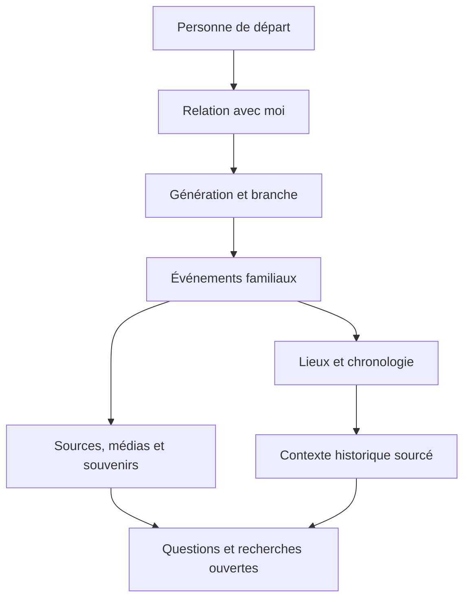

# Vision immersive de la généalogie

**Statut :** proposée, sans modification applicative dans ce lot.
**Référence :** audit, baseline et modèle présents au 7 août 2026.

## Intention

Le site doit devenir un livre familial interactif : un enfant doit pouvoir partir de lui-même, remonter une génération à la fois, rencontrer des personnes, situer leurs lieux et leurs époques, puis ouvrir les preuves qui soutiennent ce récit.

L’ambition n’est pas d’ajouter des effets. C’est de rendre le chemin entre **une personne**, **un fait**, **une preuve** et **une question encore ouverte** simple à parcourir.

## Ce qui existe déjà

La fondation est plus riche qu’un arbre seul.

| Domaine | Capacités présentes | Ce qui manque pour une expérience unifiée |
| --- | --- | --- |
| Accueil | Chiffres réels, génération la plus ancienne, périodes couvertes, pays, actes, portraits, récits et faits historiques. | Une porte narrative explicite et une progression guidée. |
| Arbre et parenté | Graphe SVG, fiche latérale, mini-arbre, calcul de parenté entre deux personnes et chemin familial. | Le lien automatique avec le membre connecté et une lecture par génération. |
| Personnes | Portrait, vie, frise personnelle, parenté, souvenirs, récits, album, sources et conversation. | Une hiérarchie de lecture « qui est cette personne pour moi ? », puis « que savons-nous d’elle ? ». |
| Chronologie | Événements familiaux, faits historiques, filtres de lignée, contexte par lieu et niveaux de preuve. | Un mode de voyage temporel synchronisé et une narration par chapitre. |
| Carte | Lieux, périodes, regroupements et migrations dérivées des événements. | Une page de lieu et une lecture de migration explicitement sourcée. |
| Archives et recherches | Sources, actes, médias, transcriptions, chantiers et pistes. | Une provenance au niveau de chaque affirmation et un parcours « mystères à résoudre ». |

## Contrat de vérité

Une expérience immersive ne doit jamais transformer un contexte en biographie, ni une hypothèse en fait. Toute vue nouvelle respecte les règles suivantes.

| Nature affichée | Base actuelle | Règle de présentation |
| --- | --- | --- |
| Fait sourcé | `acte`, `anom` et source associée | Badge visible et accès à la source ou à l’acte. |
| Fait probable | `insee` | Libellé « probable », jamais formulé comme certain. |
| Mémoire familiale | `memoire` | Attribuée comme mémoire, distincte d’un acte. |
| Hypothèse / à chercher | `hypothese`, `a_trouver`, chantier de recherche | Signalée clairement, avec la question qui reste à résoudre. |
| Contexte historique | `faits_historiques` et sa source | Présenté comme le monde autour de la famille ; une incidence individuelle n’est montrée que si elle est explicitement rattachée. |
| Contenu généré | Aucun stockage automatique à ce stade | Futur contenu généré : brouillon, provenance et étiquette obligatoires ; jamais une écriture automatique dans l’arbre. |

Le modèle actuel possède les niveaux de preuve nécessaires à une première expérience. En revanche, il ne possède pas encore une assertion versionnée par attribut : avant de faire d’une phrase narrative une affirmation fine, il faudra pouvoir relier cette phrase au fait exact et à ses sources.

## Architecture produit cible

Cette architecture ne crée pas une deuxième base de données narrative. Les vues immersives sont des **lectures dérivées** des tables existantes : `personnes`, `unions`, `filiations`, `evenements`, `lieux`, `sources`, `medias`, `souvenirs`, `recits`, `faits_historiques` et `chantiers_recherche`.

Les seules données éditoriales à introduire plus tard doivent être minimales et explicites : ordre de chapitre, introduction validée, image de couverture choisie, et éventuellement un lien vers une assertion sourcée. Elles ne doivent jamais recopier ni concurrencer les faits du graphe.

## Parcours cible

1. **Entrer.** L’accueil invite à découvrir une histoire familiale et propose une personne de départ seulement si le membre l’a choisie.
2. **Se situer.** La fiche indique le lien réel avec la personne de départ : parent, grand-parent, cousin ou lien inconnu.
3. **Remonter.** Une vue « Notre histoire » groupe les personnes par génération et explique ce que l’on sait, sans compléter les zones inconnues.
4. **Situer.** La frise et la carte font apparaître la période et les lieux associés aux événements réels.
5. **Vérifier.** Un geste unique ouvre la source, l’acte, le média ou le souvenir attaché au fait.
6. **Continuer.** Les chantiers de recherche transforment les lacunes en questions transmissibles, pas en silence ni en invention.

## Choix d’architecture

### Décision

Faire évoluer le produit par **compositions des données existantes**, route par route, avant toute migration de modèle ou refonte de navigation.

### Options écartées pour le moment

| Option | Pourquoi elle n’est pas retenue maintenant |
| --- | --- |
| Refaire l’accueil, la carte et les fiches dans une refonte unique | Risque élevé de régression et de perte des nombreuses fonctions déjà présentes. |
| Créer un CMS narratif indépendant | Dupliquerait les faits et introduirait rapidement des contradictions. |
| Générer automatiquement chapitres et biographies | Le modèle d’assertions et la validation humaine ne sont pas encore assez fins. |

### Conséquences

- Les premières évolutions peuvent être petites, réversibles et sans migration.
- Le vocabulaire de preuve existant devient le contrat de toutes les nouvelles vues.
- Les données inconnues restent visibles comme inconnues.
- Les futures migrations de provenance, de lieux historiques ou de documents devront enrichir ce socle, jamais le remplacer.

## Exigences transverses

- **Confidentialité :** les nouvelles lectures passent par les mêmes clients serveur, RLS et URL signées que les pages existantes ; aucune donnée familiale n’est introduite dans le code public.
- **Accessibilité :** navigation au clavier, titres hiérarchisés, alternative textuelle aux cartes et animations facultatives avec respect de `prefers-reduced-motion`.
- **Mobile :** une génération se lit en cartes verticales ; une carte ou frise ne doit jamais devenir l’unique manière d’accéder à une information.
- **Performance :** aucun second chargement intégral du graphe. Les vues reçoivent un sous-ensemble déjà autorisé, paginé ou filtré quand le volume le justifie.
- **Portabilité :** toute nouvelle information éditoriale doit pouvoir sortir avec les exports JSON et GEDCOM quand le format le permet.

## Réponse au test de transmission

**Pas encore complètement.** Un enfant de 12 ans peut aujourd’hui trouver un arbre, des fiches, une chronologie, une carte, des archives et des recherches. Il ne dispose pas encore d’un chemin unique qui part de lui, explique progressivement les générations, relie explicitement les lieux aux personnes et distingue à chaque étape ce qui est établi de ce qui reste à rechercher.

Il manque surtout :

1. un point de départ personnel et une relation lisible avec chaque ancêtre ;
2. une navigation par génération qui ne demande pas de comprendre d’abord un graphe dense ;
3. une synchronisation simple entre une époque, les personnes vivantes, les lieux et les événements ;
4. une provenance plus fine avant toute narration longue ou génération assistée.

La valeur de la phase 3 sera de relier les matériaux déjà présents, sans diluer leur honnêteté historique.
