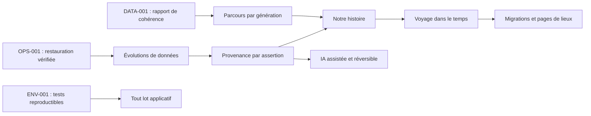

# Roadmap de l’expérience historique familiale

**Principe de séquencement :** fiabilité et preuve avant narration ; narration avant automatisation.

## Dépendances majeures

Les lots `OPS-001`, `DATA-001` et `ENV-001`, déjà inscrits dans `FIX_PLAN.md`, restent des préconditions de qualité. Aucun lot de phase 3 ne les annule.

## Les trois fonctions au meilleur ratio

| Rang | ID | Fonction | Impact | Complexité | Risque | Pourquoi maintenant |
| ---: | --- | --- | ---: | ---: | ---: | --- |
| 1 | EXP-001 | Relation avec moi sur une fiche personne | 9/10 | 2/10 | 2/10 | Le moteur de parenté, l’arbre et le lien facultatif membre-personne existent déjà. Aucune migration n’est requise. |
| 2 | EXP-002 | Notre histoire v0, lecture par génération | 10/10 | 5/10 | 4/10 | Réutilise accueil, portraits, arbre, chronologie et niveaux de preuve pour créer le chemin de transmission absent. |
| 3 | EXP-003 | Voyage dans le temps v0 | 8/10 | 5/10 | 4/10 | La chronologie, les dates partielles, la carte et le curseur de période existent déjà ; l’intégration doit rester sobre et accessible. |

## Première fonctionnalité conçue : EXP-001 — Relation avec moi

### Objectif et valeur

Sur la fiche d’une personne, un membre validé dont `membres.personne_id` est renseigné voit un encart du type « Votre arrière-grand-mère » ou « Cousin germain ». Le texte est calculé à la demande à partir du graphe réel ; il n’est jamais stocké.

Cette fonction donne immédiatement un point d’ancrage à la lecture sans inventer de lien. Si le membre n’est pas associé à une personne, ou si le graphe ne connaît pas de chemin, l’encart est simplement absent ou dit « lien non établi » selon le contexte retenu par l’UX.

### Données et architecture

| Élément | Décision |
| --- | --- |
| Données | `membres.personne_id`, session validée, `chargerArbre({ signerPhotosPour: 'aucun' })`, `calculerParente`. |
| Écriture / migration | Aucune. |
| Autorisation | Lecture serveur uniquement ; RLS demeure l’autorité sur les personnes visibles. |
| Calcul | Réutiliser `calculerParente(personneCible, personneDuMembre)` et adapter la formulation au point de vue du membre. |
| Affichage | Petit encart dans la vue d’ensemble de la fiche, après l’identité et avant la chronologie. |
| Absences | Aucun encart si la session, le rattachement membre-personne ou la personne cible ne sont pas disponibles ; aucun identifiant ne fuit dans le HTML. |

### Fichiers pressentis

- `src/app/personne/[id]/page.tsx` : lecture de la session et préparation de la donnée dérivée.
- Un nouveau composant étroit sous `src/components/personne/` : affichage accessible, sans requête propre.
- Un test unitaire synthétique du point de vue et des cas sans lien, à placer près des tests de parenté existants ou à créer dans `scripts/` selon les conventions établies.

Les fichiers protégés par `CONVENTIONS.md` et les migrations ne sont pas concernés.

### UX, accessibilité et performance

- Desktop et mobile : un texte court, jamais une infographie nécessaire à la compréhension.
- Lecteur d’écran : titre explicite « Votre lien avec cette personne ».
- Les termes « parent », « ancêtre » ou « lien non établi » sont préférés à une approximation quand le sexe ou le chemin ne permet pas de libellé sûr.
- Le calcul s’appuie sur le graphe déjà chargé pour la fiche ; aucune requête de média ni URL signée supplémentaire.

### Tests et rollback

- Ancêtre, descendant, fratrie, cousin et deux personnes sans ancêtre commun.
- Membre sans `personne_id`, membre non validé, personne masquée par RLS et identifiant de fiche invalide.
- TypeScript, lint, test ciblé et contrôle mobile avant commit.
- Rollback : suppression de l’encart et de la donnée dérivée, sans état persistant à restaurer.

### Statut

**Implémenté dans le lot EXP-001.** L’encart n’ajoute aucune donnée, ne s’affiche que pour un membre validé rattaché à une personne visible, et reste absent lorsque le lien n’est pas établi.

## Phases suivantes

| Phase | Objectif | Données / architecture | Sortie attendue | Risque principal |
| --- | --- | --- | --- | --- |
| 3A — Confiance | Terminer restauration, rapport de cohérence et tests reproductibles ; préparer la provenance par assertion. | Documentation, tests, puis migration isolée seulement après validation. | Une donnée vérifiable avant toute narration longue. | Faire une migration de sources trop large. |
| 3B — Exploration | EXP-001 puis EXP-002. | Calculs dérivés du graphe, route narrative distincte, données éditoriales minimales. | Une personne peut se situer et remonter les générations. | Masquer les lacunes au lieu de les montrer. |
| 3C — Temps et géographie | EXP-003, filtres synchronisés, migrations fondées sur événements explicites, pages de lieux. | URL partageable pour la période ; sous-ensembles d’événements et lieux. | Comprendre où et quand, sans déduire une migration inexistante. | Confondre naissance dans un lieu et déplacement. |
| 3D — Archives | Fiche documentaire, transcription, état de conservation, recherche. | Extension progressive de `medias` et `sources`, sans dupliquer les fichiers. | Ouvrir une preuve depuis un fait. | Modèle documentaire trop rigide. |
| 3E — Récit | Chapitres familiaux validés, contexte et parcours guidé. | Les chapitres référencent faits, personnes et sources existants. | « Notre histoire » lisible d’un bout à l’autre. | Narration plus forte que les preuves. |
| 3F — Assistance | OCR, suggestions et brouillons de biographies. | Proposition distincte des données publiées, validation humaine obligatoire. | Aider à chercher, jamais éditer automatiquement. | Hallucination ou publication non revue. |
| 3G — Transmission | Livre, exports d’archive, délégation et mode présentation. | Exports, runbook et rôles de conservation. | Projet transmissible à une nouvelle génération. | Dépendance à une seule personne ou plateforme. |

## Règles de réalisation

1. Un lot ne traite qu’une fonction ou une dépendance directe.
2. Aucun nom, date, lieu ou document familial ne rejoint le dépôt public.
3. Une carte, une animation ou une IA n’est ajoutée que si une question familiale précise ne peut pas être mieux traitée par une vue simple.
4. Toute vue narrative montre son niveau de preuve ; le contexte historique conserve sa source propre.
5. Avant un lot de code : état Git propre autour du périmètre, test reproductible disponible, rollback décrit.
