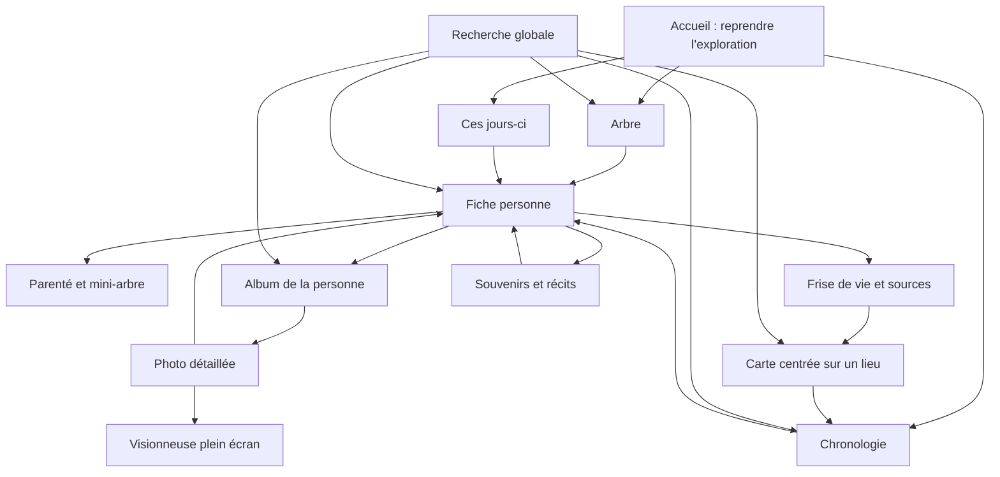

# Carte de navigation UX cible

Cette carte ne remplace pas les routes actuelles. Elle décrit comment les relier afin que la famille explore une seule mémoire familiale plutôt qu’une suite de modules.



## Navigation principale proposée

| Contexte | Entrées prioritaires | Entrées secondaires |
| --- | --- | --- |
| Mobile | Accueil, Arbre, Rechercher, Souvenirs, Plus | Chronologie, Carte, Récits, Histoire, Archives, outils. |
| Desktop | Accueil, Arbre, Chronologie, Carte, Souvenirs | Recherche globale, récits, histoire, archives, parenté, export. |
| Fiche personne | Voir l’arbre, Album ou chronologie selon le contenu | Sources, souvenirs, récits, contribution selon les droits. |
| Photo | Agrandir, identifier / commenter, revenir au contexte | Lieu, date, album, partage selon les droits futurs. |

La navigation principale actuelle ne doit pas être modifiée dans ce lot : elle est exclue par les conventions du dépôt. Cette proposition sert de contrat pour un prochain changement explicitement autorisé.

## Règles de transition

- Un lien personne ouvre toujours sa fiche ; une personne sur une photo ouvrira cette même fiche.
- Un lieu ouvre la carte filtrée ; une année ouvre une chronologie filtrée quand ce filtre existe.
- Une photo conserve à terme son contexte d’origine (album, personne ou période) pour le suivant/précédent.
- Le retour privilégie le contexte précédent ; à défaut, un lien explicite décrit la destination.
- Toute action critique reste visible : les gestes et raccourcis complètent l’interface, ils ne la remplacent pas.

## Wireframes textuels de référence

### Mobile — photo

```text
← Album de [personne]
Titre · date · lieu
+[ image, toucher pour plein écran ]+
+[ Agrandir la photo ]
Description
Souvenirs sur cette photo
```

### Desktop — fiche personne

```text
Retour à l’arbre
Parenté immédiate / mini-arbre
Identité, preuves, lien avec moi
+[ Vue | Parenté | Souvenirs | Album | Conversation ]
Contenu de l’onglet
Continuer : fratrie · chronologie · autre membre
```

### Mobile — arbre

```text
Menu · L’arbre de Léo · notifications
Recherche visible ou raccourci explicite
Arbre focalisé, zoom et mini-carte
Action contextuelle : ouvrir la fiche / ajouter selon les droits
```

## Objectifs mesurables

| Action | Objectif |
| --- | --- |
| Ouvrir la photo en grand depuis une fiche | 3 interactions au plus (fiche → Album → photo), puis 1 pour le plein écran. |
| Voir les photos d’une personne trouvée dans l’arbre | 2 interactions après ouverture de la fiche. |
| Remonter d’une génération | 1 action par personne, sans formulaire ni changement de module. |
| Lancer une recherche | 1 action depuis toute page, après EXP-UX-002. |
| Réduire le mouvement | Toutes les animations restent optionnelles via les préférences système. |
